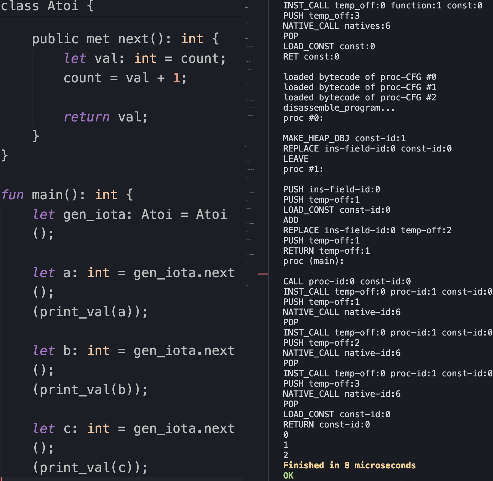

# README

### Brief
My second ever project in Rust. This will become a mini-language called Loxie as a very small derivative of the educational Lox language.

### A peek at Loxie

### Design
 - Paradigms: imperative, object-oriented, and some functional?
 - Static & strong typing + null safety
 - Declared procedures & classes
 - Built-in functions galore!
 - NOTE: the compiler only reads sources relative to the `loxie_lib` directory or the invoked-from directory for now.

### Upcoming Updates
 - Improve diagnostics & String support (0.4.3)
   - Fix `String`... fix method calls _within_ a class.
 - Replace VM with register VM! (0.5.0)
 - Support arrays. (0.6.0)
 - Add more standard I/O native functions! (0.6.1)
 - Improve syntax highlighting on Loxie's local VSCode extension:
   - Add these keywords: `ctor`, `class`, `private`, `public`, `met`
   - Add these typenames: `char`, `varchar`

### Other Docs
 - [Grammar Info](./docs/Grammar.md)
 - [Runtime Info](./docs/Runtime.md)
 - [Progress Images](./docs/Progress.md)
