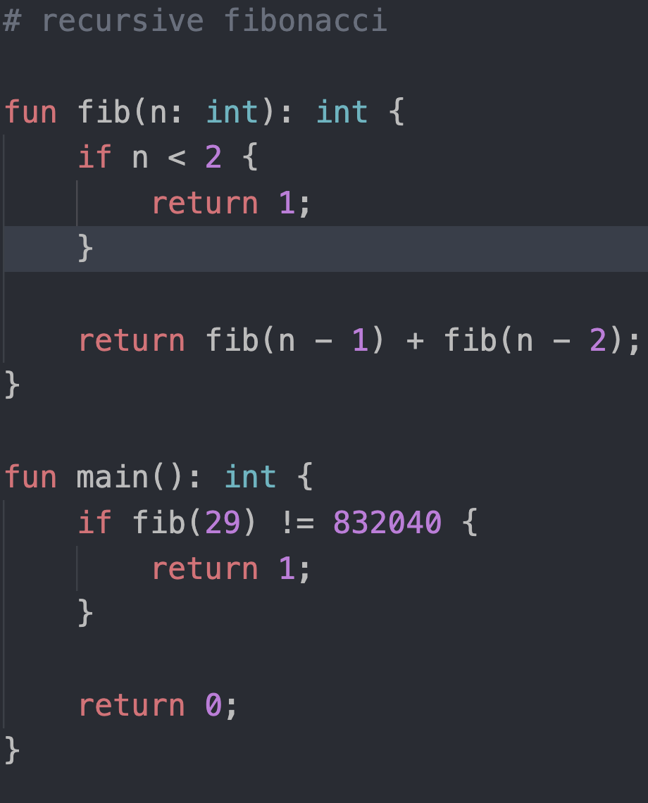

# README

### Brief
My second ever project in Rust. This will become a mini-language called Loxie as a very small derivative of the educational Lox language.

### What Loxie Looks Like

### Design
 - Procedural & functional paradigm
 - Static & strong typing + null safety
 - First-class lambdas vs. declared procedures
 - Built-in functions galore!

### Roadmap
 - Add native functions (**EXPERIMENTAL**)
 - Add simple checks for types and declarations
 - Add optimization passes on IR
    - Instruction substitutions
    - Dead code elimination
 - Support arrays
 - Support strings
 - Support lambdas

### Other Docs
 - [Runtime Info](./docs/Runtime.md)
 - [Progress Images](./docs/Progress.md)
