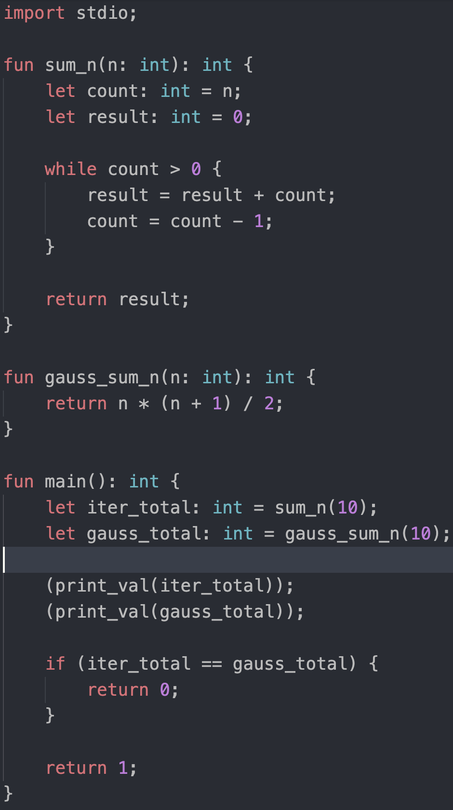

# Progress

## Brief
This is a gallery showing all developmental milestones of Loxie.

### First Codegen (`ifs.loxie`)
 - Created CFG to bytecode logic, handling simple branching for if/else statements.

#### Image:

### Major Language Update 1 (`print_sum.loxie`)
 - Added while loops
 - Added foreign functions
 - Added imports
 - Created custom syntax highlighting

#### Image:

### Major Language Update 2 (`iota.loxie`)
 - Added support for simple classes (no inheritance or polymorphism yet).

#### Image:

